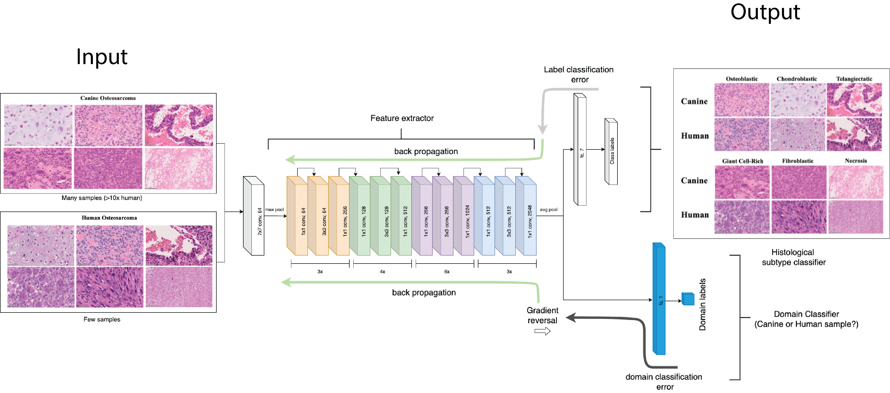

# Deep domain adversarial learning for classification of rare histological variants and prognosis of canine osteosarcomas
Osteosarcomas are aggressive tumors of the bone with many divergent histologies. High tumor heterogeneity coupled with scarcity of samples render clinical interpretation and prognosis of osteosarcomas challenging. While osteosarcomas are relatively rare in humans, they are similar to those commonly observed in dogs, both at the histological and molecular level. Here, we apply a domain adversarial learning framework that trains neural networks to distinguish different rare histological subtypes of osteosarcomas in both dogs and humans. We show that adversarial learning improves domain adaption of the classification model from dogs to humans when evaluated on unseen whole slide image patches achieving an average multi-class F1 score of 0.77 (CI: 0.74-0.79) and 0.80 (CI: 0.78-0.81), compared to the ground truth in dogs and humans, respectively. Furthermore, we uncover two distinct populations of dogs based on model-predicted spatial distribution of different histological subtypes, which have markedly different responses to standard of care therapy. This repository contains the codes to train a CNN to classify rare histological variants of osteosarcoma in a species agnostic fashion with the help of [adversarial learning](http://proceedings.mlr.press/v37/ganin15.html). The schematic diagram describing the adversarial learning approach is shown below. See [Survival analysis](Survival_analysis.md) for reproducing survival results. 

