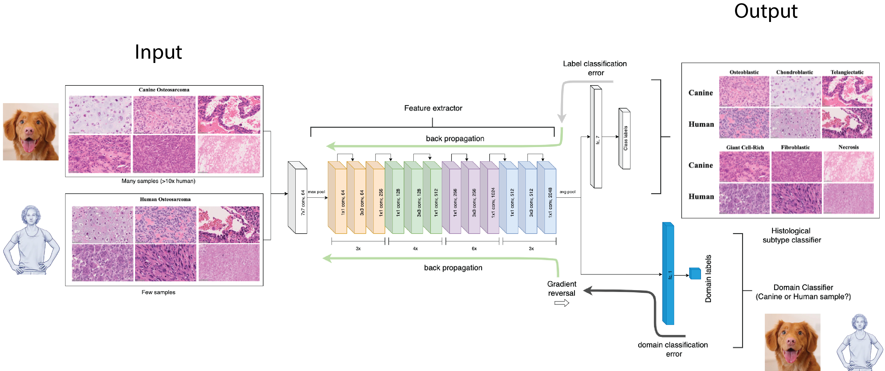
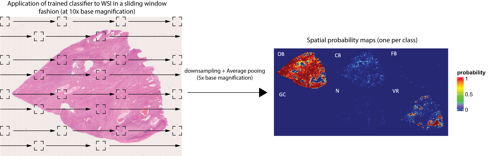

# Deep domain adversarial learning for classification of histologic subtypes of osteosarcomas in canines and humans
Osteosarcomas are aggressive tumors of the bone with many divergent histologies. High tumor heterogeneity coupled with scarcity of samples render clinical interpretation and prognosis of osteosarcomas challenging. While osteosarcomas are relatively rare in humans, they are similar to those commonly observed in dogs, both at the histological and molecular level. Here, we apply a domain adversarial learning framework that trains neural networks to distinguish different histologic subtypes of osteosarcomas in both dogs and humans. We show that adversarial learning improves domain adaption of the classification model from dogs to humans when evaluated on unseen whole slide image patches achieving an average multi-class F1 score of 0.77 (CI: 0.74-0.79) and 0.80 (CI: 0.78-0.81), compared to the ground truth in dogs and humans, respectively. Furthermore, we uncover two distinct populations of dogs based on model-predicted spatial distribution of different histological subtypes, which have markedly different responses to standard of care therapy. This repository contains the codes to train a CNN to classify histologic subtypes of osteosarcoma in a species agnostic fashion with the help of [adversarial learning](http://proceedings.mlr.press/v37/ganin15.html). The schematic diagram describing the adversarial learning approach is shown below. See [Survival analysis](Survival_analysis.md) for reproducing survival results. 


## Requirements
<ul>
  <li> python>=3.6 </li>
  <li> openslide=1.1.1 </li>
  <li> pytorch=1.9+cu111 </li>
  <li> torchvision=0.10.0+cu111 </li>
</ul>

## Instructions for adversarially training a resnet50 CNN on canine and human whole slide imaging (WSI) data
Prior to running the [training script](dogOS_domain_adapt.py), pre-process the canine (source) and human (target) whole slide imaging cohorts to extract non-overlapping patches from tissue regions. Each WSI patch should be saved in a directory corresponding to the slide with the patch class label appended to the filename. The file structure for each cohort is as follows.

```bash
├── rootdir
│   ├── slide1
│   │   ├── slide1_patch1_patchlabel-%area.png
│   │   ├── slide1_patch2_patchlabel-%area.png
│   │   ├── ...
│   ├── slide2
│   │   ├── slide2_patch1_patchlabel-%area.png
│   │   ├── slide2_patch2_patchlabel-%area.png
│   │   ├── ...
...
...
│   ├── slideN
```
*Note:* A patch can have more than one class label depending on overlapping pathologist annotations. See the [training script](dogOS_domain_adapt.py) for how a unique class label for such patches is generated. After pre-processing the data, the training script can be invoked as follows:

```
python dogOS_domain_adapt.py --source <path/to/source/rootdir> --target <path/to/target/rootdir>
```

## Instructions for generating spatial probability maps corresponding to each whole slide image
To generate spatial probability maps for each WSI using the trained model, you can run the following command. The [inference script](inference_prob-map_SP_full_final.py) will then generate spatial probability maps, one per histological subtype as shown in the diagram below:

```
python inference_prob-map_SP_full_final.py --csv <csv file containing paths to WSI> --fe </path/to/feature/extractor/weights> --cls </path/to/classifier/weights> --savedir </path/to/save/location>
```




Once probability maps have been generated, run [simple_feature_aggregation.py](simple_feature_aggregation.py) as shown below to estimate the burden of each osteosarcoma variant in each whole slide image. 
```
python simple_feature_aggregation.py --savedir </path/to/saved/location/of/probability/maps>
```

Given the estimated burden for each whole slide image, one can then perform remaining downstream analyses as described [here](Survival_analysis.md)

## Access to trained model weights
For access to the trained model weights or any additional questions, please contact: [patkar.sushant@nih.gov](patkar.sushant@nih.gov)
