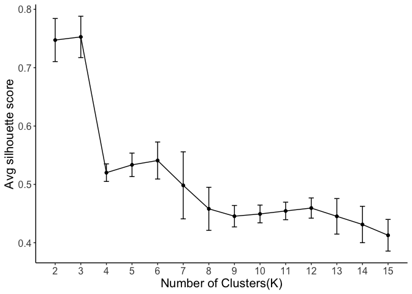
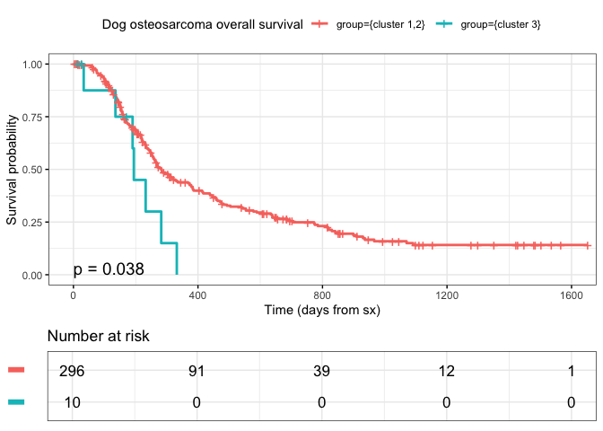
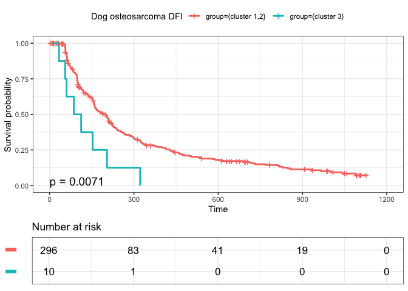
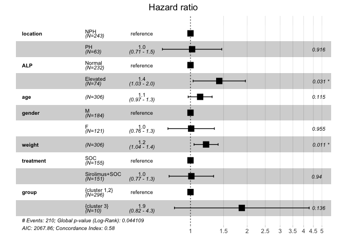
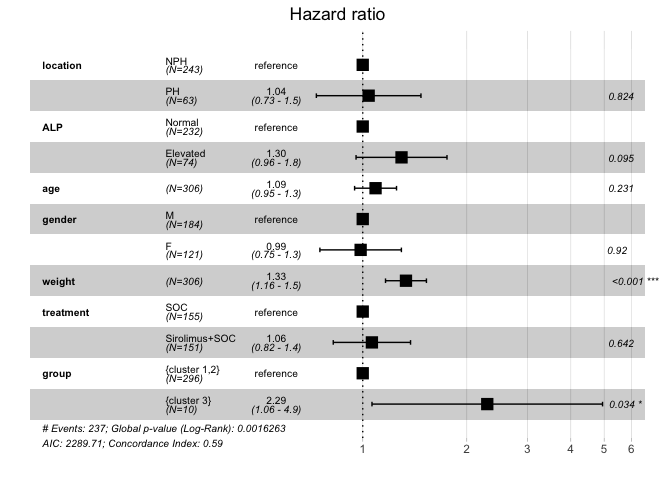
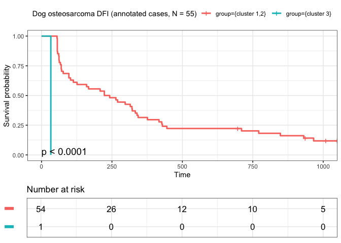
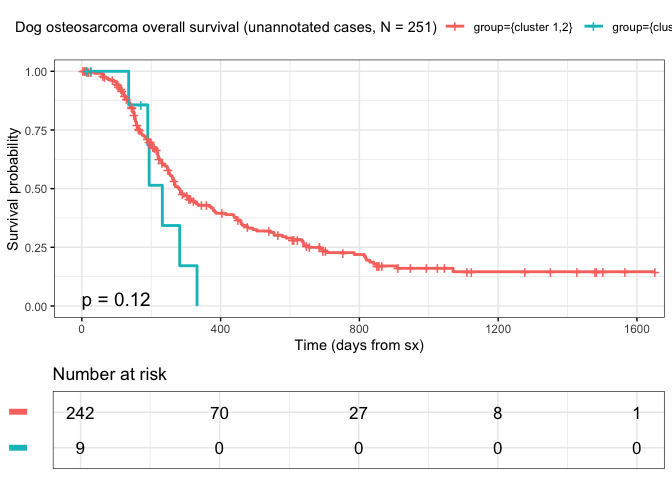
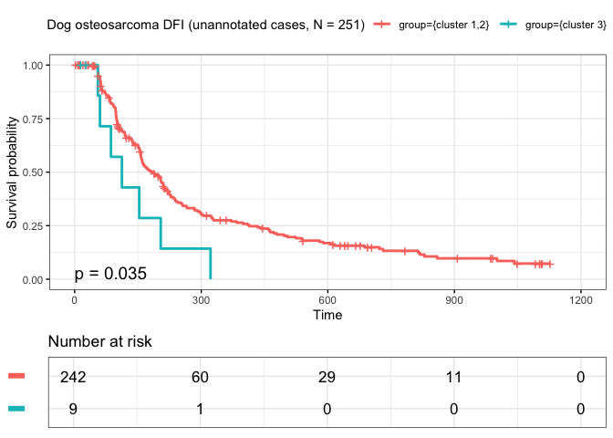

# Load required libraries

``` r
library(survival)
library(survminer)
```

    ## Loading required package: ggplot2

    ## Loading required package: ggpubr

    ## 
    ## Attaching package: 'survminer'

    ## The following object is masked from 'package:survival':
    ## 
    ##     myeloma

``` r
library(ggplot2)
library(GGally)
```

    ## Registered S3 method overwritten by 'GGally':
    ##   method from   
    ##   +.gg   ggplot2

``` r
library(data.table)
library(factoextra)
```

    ## Welcome! Want to learn more? See two factoextra-related books at https://goo.gl/ve3WBa

``` r
library(readr)
```

    ## Warning: package 'readr' was built under R version 4.1.2

``` r
library(readxl)
library(cluster)
library(rstatix)
```

    ## 
    ## Attaching package: 'rstatix'

    ## The following object is masked from 'package:stats':
    ## 
    ##     filter

``` r
library(matrixStats)
```

# Read in the histological and clinical metadata of canine OS samples

``` r
#Scripts to read in the canine OS clinical metadata

#clinical metadata for all cases that received Rapamycin (mTOR inhibitor) in addition to standard of care therapy
Slides2Outcomes_Rapa_all <- read_csv("~/Dog/Slides2Outcomes_Rapa_all_new.csv")
```

    ## New names:
    ## * `` -> ...1

    ## Rows: 295 Columns: 24
    ## ── Column specification ────────────────────────────────────────────────────────
    ## Delimiter: ","
    ## chr (15): Study, Site, Name, breed, gender, Tumor Location, PH vs NPH, ALP, ...
    ## dbl  (9): ...1, Patient ID, age, weight, PH, DFI, DFI_censor, Survival (days...
    ## 
    ## ℹ Use `spec()` to retrieve the full column specification for this data.
    ## ℹ Specify the column types or set `show_col_types = FALSE` to quiet this message.

``` r
#clinical metadata for all cases that received standard of care therapy
Slides2Outcomes_SOC_all <- read_csv("~/Dog/Slides2Outcomes_SOC_all_new.csv")
```

    ## New names:
    ## * `` -> ...1
    ## Rows: 305 Columns: 24── Column specification ────────────────────────────────────────────────────────
    ## Delimiter: ","
    ## chr (15): Study, Site, Name, breed, gender, Tumor Location, PH vs NPH, ALP, ...
    ## dbl  (9): ...1, Patient ID, age, weight, PH, DFI, DFI_censor, Survival (days...
    ## ℹ Use `spec()` to retrieve the full column specification for this data.
    ## ℹ Specify the column types or set `show_col_types = FALSE` to quiet this message.

``` r
dat1 <- subset(Slides2Outcomes_Rapa_all,select = c("slide","Patient ID","Tumor Location","Site","age","weight","breed","gender","PH","ALP","Group","DFI","DFI_censor","Survival (days from sx)","Surv_censor"))
dat1$treatment = rep("Rapamycin", nrow(dat1))

dat2 <- subset(Slides2Outcomes_SOC_all,select = c("slide","Patient ID","Tumor Location","Site","age","weight","breed","gender","PH","ALP","Group","DFI","DFI_censor","Survival (days from sx)","Surv_censor"))
dat2$treatment = rep("SOC", nrow(dat2))

clindat_all <- rbind(dat1,dat2)
clindat_all <- as.data.frame(clindat_all)
clindat_all <- clindat_all[!duplicated(clindat_all$slide),]
rownames(clindat_all) <- substr(clindat_all$slide,1,19)
clindat_all <- clindat_all[,-1]
colnames(clindat_all)[c(11,12,13,14)] <- c("DFS_time","DFS_status","OS_time","OS_status")
clindat_all$ALP[clindat_all$ALP == "elevated"] <- "Elevated"


#read in estimated burden for each histological subtype (determined by AI predictions)
dog_slide_level_features <- read.csv("~/Downloads/dog_slide_level_features.csv")
rownames(dog_slide_level_features) <- dog_slide_level_features$slide
dog_slide_level_features <- dog_slide_level_features[,-1]

#slides previously annotated by pathologist and used to train and validate AI classifier
ann_slides = union(list.files('~/Dog/annotations/',pattern = "*.xml"), union(list.files('~/Dog/annotations_new/',pattern = "*.xml"),list.files('~/Dog/annotations_19012022/',pattern = '*.xml')))
ann_slides1 = sapply(ann_slides, function(x) gsub('\\.xml','',x))


#collect histological data for all cases with matched clinical metadata
common <- intersect(rownames(clindat_all),rownames(dog_slide_level_features))
clindat_all <- clindat_all[common,]
dog_slide_level_features <- dog_slide_level_features[common,]

#record which slides were previously annotated by pathologist
clindat_all$annotated <- sapply(common, function(x) x %in% ann_slides1)

dd <- dog_slide_level_features

#number of slides scanned per case
nslides = as.numeric(table(clindat_all$`Patient ID`))
names(nslides) <- names(table(clindat_all$`Patient ID`))

#aggregate estimated burden of each subtype over multiple slides to generate case level features. See Methods section of the manuscript
dd_patient <- aggregate.data.frame(dd, by = list(as.character(clindat_all$`Patient ID`)), FUN = mean)

#aggregating clinical data of each case and aligning with histological features
clindat_all <- clindat_all[!duplicated(clindat_all$`Patient ID`),]
rownames(dd_patient) <- as.character(dd_patient$Group.1)
dd_patient <- dd_patient[,-1]
dd_patient <- dd_patient[as.character(clindat_all$`Patient ID`),]
clindat_all$isFemale <- grepl("female", ignore.case = T, clindat_all$gender)

#merge the histological and clinical metadata into one table
clindat_all <- cbind(clindat_all, dd_patient)

#record the number of slides scanned per case
clindat_all$nslides <- nslides[as.character(clindat_all$`Patient ID`)]
```

# Perform K-means clustering

``` r
#scripts to run K-means clustering anlysis of cases based on estimated burden of each histological variant in each case
set.seed(55243)
res = prcomp(apply(dd_patient,2,scale))
k7 = kmeans(res$x[,c(1,2)], centers=3, nstart = 100,iter.max = 500)


avg_sil <- function(c, idx) {
  res = prcomp(apply(dd_patient[idx,],2,scale))
  km.res <- kmeans(res$x[,c(1,2)], centers = c, nstart = 100, iter.max = 500)
  ss <- silhouette(km.res$cluster, dist(res$x[,c(1,2)]))
  mean(ss[, 3])
}

# Compute and plot wss for k = 2 to k = 15
k.values <- c(2:15)

# extract avg silhouette for 2-15 clusters
avg_sil_values <- t(sapply(k.values, function(k) {
  strt = Sys.time()
  vals <- sapply(1:100, function(x) {
    idx = sample(seq(nrow(dd_patient)),as.integer(nrow(dd_patient)*0.8))
    return(avg_sil(k, idx))
  })
  print(Sys.time() - strt)
  return(vals)
}))
```

    ## Time difference of 0.740078 secs
    ## Time difference of 0.821826 secs
    ## Time difference of 0.9210508 secs
    ## Time difference of 1.140826 secs
    ## Time difference of 1.271089 secs
    ## Time difference of 1.384421 secs
    ## Time difference of 1.527668 secs
    ## Time difference of 1.734425 secs
    ## Time difference of 2.006827 secs
    ## Time difference of 2.101489 secs
    ## Time difference of 2.295859 secs
    ## Time difference of 2.307146 secs
    ## Time difference of 2.394569 secs
    ## Time difference of 2.53741 secs

# Plot K-means clustering analysis results

``` r
#scripts to plot the clustering analysis results

#compute the empirical mean and standard deviation of silhouette scores for each value of K ranging from 2 to 15
mean_sil = rowMeans(avg_sil_values)
sd_sil = rowSds(avg_sil_values)

#plot the avg slihouette scores for each value of K ranging from 2 to 15, the smallest value of K yielding the highest score reflects the optimal clustering of the data
pp <- ggplot(data = data.frame(K = k.values, score = mean_sil), aes(x=K, y=score)) + 
  geom_line() +
  geom_point() + 
  geom_errorbar(aes(ymin=score-sd_sil, ymax=score+sd_sil), position = position_dodge(0.05), width=0.2) + xlab("Number of Clusters(K)") + ylab("Avg silhouette score") + theme_classic()
pp <- pp + scale_x_continuous(breaks=seq(2,15,1)) + theme(text = element_text(size = 15))

print(pp)
```



``` r
pp2 <- fviz_cluster(k7, data = res$x[,c(1,2)], repel = TRUE, geom="point") + theme(text = element_text(size = 15)) + theme_classic()
print(pp2)
```


``` r
#fig <- ggarrange(pp, pp2, labels = c("A","B"), nrow = 1, ncol = 2)
#print(fig)

#Plot the distribution of burden for each OS subtype in each cluster
c1 <- clindat_all
c1$cluster <- as.character(as.numeric(k7$cluster))
c1$group <- c("{cluster 1,2}","{cluster 3}")[as.numeric(k7$cluster==3)+1]
colnames(c1)[colnames(c1) == "HN"] = "N"
dist_mat = melt(subset(c1, select = c("CB","FB","GC","N","OB","VR","cluster")))
```

    ## Warning in melt(subset(c1, select = c("CB", "FB", "GC", "N", "OB", "VR", :
    ## The melt generic in data.table has been passed a data.frame and will attempt
    ## to redirect to the relevant reshape2 method; please note that reshape2 is
    ## deprecated, and this redirection is now deprecated as well. To continue using
    ## melt methods from reshape2 while both libraries are attached, e.g. melt.list,
    ## you can prepend the namespace like reshape2::melt(subset(c1, select = c("CB",
    ## "FB", "GC", "N", "OB", "VR", "cluster"))). In the next version, this warning
    ## will become an error.

    ## Using cluster as id variables

``` r
colnames(dist_mat) <- c("cluster","variant","area")

stat.test <- dist_mat %>% group_by(variant) %>% t_test(area ~ cluster) %>% add_significance("p") %>% add_xy_position(x = "variant", dodge = 0.8)
bxp <- ggplot(
  dist_mat, aes(x = variant, y = area, 
  color = cluster)) + geom_boxplot()
p5 <- bxp + stat_pvalue_manual(
  stat.test,  label = "{p.signif}", 
  tip.length = 0, hide.ns = TRUE
  ) +  ylab("Burden") + xlab("variant") + theme_classic()
print(ggarrange(p5, labels = "", nrow = 1, ncol = 1))
```


# Plot survival rates of dogs based on cluster membership.

``` r
#Kaplan-Meier survival plots and log-rank test to assess the significance of difference in survival rates
surv <- survfit(Surv(OS_time, OS_status) ~ group, data = c1)
diff <- survfit(Surv(OS_time, OS_status) ~ group, data = c1)

p1 <- ggsurvplot(surv, data = c1,
                  
                  legend.title = "Dog osteosarcoma overall survival",
                  conf.int = F,
                  pval = TRUE,
                  risk.table = TRUE,
                  tables.height = 0.2,
                  tables.theme = theme_cleantable(),
                  risk.table.y.text = FALSE,
                 pval.coord = c(0, 0.03),
                  # Color palettes. Use custom color: c("#E7B800", "#2E9FDF"),
                  # or brewer color (e.g.: "Dark2"), or ggsci color (e.g.: "jco")
                  ggtheme = theme_bw() # Change ggplot2 theme
) + xlab("Time (days from sx)")

surv <- survfit(Surv(DFS_time, DFS_status) ~ group, data = c1)
diff <- survfit(Surv(DFS_time, DFS_status) ~ group, data = c1)

p2 <- ggsurvplot(surv, data = c1,
                  legend.title = "Dog osteosarcoma DFI",
                  conf.int = F,
                  pval = TRUE,
                  risk.table = TRUE,
                  tables.height = 0.2,
                  tables.theme = theme_cleantable(),
                  risk.table.y.text = FALSE,
                 pval.coord = c(0, 0.03),
                  # Color palettes. Use custom color: c("#E7B800", "#2E9FDF"),
                  # or brewer color (e.g.: "Dark2"), or ggsci color (e.g.: "jco")
                  ggtheme = theme_bw() # Change ggplot2 theme
)
fig1 <- ggarrange(p1[[1]],p1[[2]], nrow = 2,ncol = 1,heights = c(3,1))
fig2 <- ggarrange(p2[[1]],p2[[2]], nrow = 2,ncol = 1,heights = c(3,1))
print(fig1)
```



``` r
print(fig2)
```



``` r
#Cox proportional hazard regression analysis to estimate the unique contribution of each measured factor.
cph_dat <- data.frame(time = c1$OS_time,
                      status = c1$OS_status,
                      group = c1$group,
                      location = c("NPH","PH")[as.numeric(c1$PH)+1],
                      ALP = c1$ALP,
                      age = scale(as.numeric(c1$age)),
                      gender = c1$gender,
                      weight = scale(c1$weight),
                      treatment = c("SOC","Sirolimus+SOC")[as.numeric(c1$treatment == "Rapamycin")+1])
cph_dat$gender[grepl("female", ignore.case = T, cph_dat$gender)] = "F"
cph_dat$gender[grepl("male", ignore.case = T, cph_dat$gender)] = "M"
cph_dat$ALP[cph_dat$ALP != "Elevated"] = "Normal"
#cph_dat$isFemale = as.numeric(cph_dat$isFemale == "F")
cph_dat$ALP <- relevel(as.factor(cph_dat$ALP), ref = "Normal")
cph_dat$treatment <- relevel(as.factor(cph_dat$treatment), ref = "SOC")
cph_dat$location <- relevel(as.factor(cph_dat$location), ref = "NPH")
cph_dat$gender <- relevel(as.factor(cph_dat$gender), ref = "M")
fit <- coxph(Surv(time, status) ~ location + ALP + age + gender + weight + treatment +  group, data = cph_dat)
print(summary(fit))
```

    ## Call:
    ## coxph(formula = Surv(time, status) ~ location + ALP + age + gender + 
    ##     weight + treatment + group, data = cph_dat)
    ## 
    ##   n= 303, number of events= 210 
    ##    (3 observations deleted due to missingness)
    ## 
    ##                            coef exp(coef) se(coef)     z Pr(>|z|)  
    ## locationPH             0.019587  1.019780 0.185376 0.106   0.9159  
    ## ALPElevated            0.352498  1.422617 0.163340 2.158   0.0309 *
    ## age                    0.118098  1.125354 0.074859 1.578   0.1147  
    ## genderF                0.008108  1.008141 0.145065 0.056   0.9554  
    ## weight                 0.190703  1.210099 0.075237 2.535   0.0113 *
    ## treatmentSirolimus+SOC 0.010477  1.010532 0.139024 0.075   0.9399  
    ## group{cluster 3}       0.628359  1.874531 0.420995 1.493   0.1356  
    ## ---
    ## Signif. codes:  0 '***' 0.001 '**' 0.01 '*' 0.05 '.' 0.1 ' ' 1
    ## 
    ##                        exp(coef) exp(-coef) lower .95 upper .95
    ## locationPH                 1.020     0.9806    0.7091     1.467
    ## ALPElevated                1.423     0.7029    1.0329     1.959
    ## age                        1.125     0.8886    0.9718     1.303
    ## genderF                    1.008     0.9919    0.7587     1.340
    ## weight                     1.210     0.8264    1.0442     1.402
    ## treatmentSirolimus+SOC     1.011     0.9896    0.7695     1.327
    ## group{cluster 3}           1.875     0.5335    0.8214     4.278
    ## 
    ## Concordance= 0.577  (se = 0.021 )
    ## Likelihood ratio test= 14.43  on 7 df,   p=0.04
    ## Wald test            = 15.44  on 7 df,   p=0.03
    ## Score (logrank) test = 15.61  on 7 df,   p=0.03

``` r
p3 <- ggforest(fit, data = cph_dat,fontsize = 0.7, noDigits = 2,)

cph_dat <- data.frame(time = c1$DFS_time,
                      status = c1$DFS_status,
                      group = c1$group,
                      location = c("NPH","PH")[as.numeric(c1$PH)+1],
                      ALP = c1$ALP,
                      age = scale(as.numeric(c1$age)),
                      gender = c1$gender,
                      weight = scale(c1$weight),
                      treatment = c("SOC","Sirolimus+SOC")[as.numeric(c1$treatment == "Rapamycin")+1])
cph_dat$gender[grepl("female", ignore.case = T, cph_dat$gender)] = "F"
cph_dat$gender[grepl("male", ignore.case = T, cph_dat$gender)] = "M"
cph_dat$ALP[cph_dat$ALP != "Elevated"] = "Normal"
#cph_dat$isFemale = as.numeric(cph_dat$isFemale == "F")
cph_dat$ALP <- relevel(as.factor(cph_dat$ALP), ref = "Normal")
cph_dat$treatment <- relevel(as.factor(cph_dat$treatment), ref = "SOC")
cph_dat$location <- relevel(as.factor(cph_dat$location), ref = "NPH")
cph_dat$gender <- relevel(as.factor(cph_dat$gender), ref = "M")
fit <- coxph(Surv(time, status) ~ location + ALP + age + gender + weight + treatment +  group, data = cph_dat)
print(summary(fit))
```

    ## Call:
    ## coxph(formula = Surv(time, status) ~ location + ALP + age + gender + 
    ##     weight + treatment + group, data = cph_dat)
    ## 
    ##   n= 303, number of events= 237 
    ##    (3 observations deleted due to missingness)
    ## 
    ##                            coef exp(coef) se(coef)      z Pr(>|z|)    
    ## locationPH              0.03950   1.04029  0.17784  0.222   0.8242    
    ## ALPElevated             0.25854   1.29503  0.15464  1.672   0.0946 .  
    ## age                     0.08549   1.08925  0.07130  1.199   0.2305    
    ## genderF                -0.01395   0.98615  0.13858 -0.101   0.9198    
    ## weight                  0.28821   1.33403  0.06958  4.142 3.44e-05 ***
    ## treatmentSirolimus+SOC  0.06110   1.06301  0.13141  0.465   0.6419    
    ## group{cluster 3}        0.83001   2.29334  0.39203  2.117   0.0342 *  
    ## ---
    ## Signif. codes:  0 '***' 0.001 '**' 0.01 '*' 0.05 '.' 0.1 ' ' 1
    ## 
    ##                        exp(coef) exp(-coef) lower .95 upper .95
    ## locationPH                1.0403     0.9613    0.7341     1.474
    ## ALPElevated               1.2950     0.7722    0.9564     1.754
    ## age                       1.0893     0.9181    0.9472     1.253
    ## genderF                   0.9862     1.0140    0.7516     1.294
    ## weight                    1.3340     0.7496    1.1640     1.529
    ## treatmentSirolimus+SOC    1.0630     0.9407    0.8216     1.375
    ## group{cluster 3}          2.2933     0.4360    1.0636     4.945
    ## 
    ## Concordance= 0.586  (se = 0.021 )
    ## Likelihood ratio test= 23.12  on 7 df,   p=0.002
    ## Wald test            = 25.51  on 7 df,   p=6e-04
    ## Score (logrank) test = 25.95  on 7 df,   p=5e-04

``` r
p4 <- ggforest(fit, data = cph_dat,fontsize = 0.7, noDigits = 2)
print(p3)
```



``` r
print(p4)
```



# Checking consistency of survival association among cases previously annotated by pathologist vs completely new cases

``` r
#by annotations
c1 <- clindat_all
c1$group <- c("{cluster 1,2}","{cluster 3}")[as.numeric(k7$cluster==3)+1]
c1 = c1[c1$annotated,]
surv <- survfit(Surv(OS_time, OS_status) ~ group, data = c1)
diff <- survfit(Surv(OS_time, OS_status) ~ group, data = c1)

p1 <- ggsurvplot(surv, data = c1,
                  
                  legend.title = "Dog osteosarcoma overall survival (annotated cases, N = 55)",
                  conf.int = F,
                  pval = TRUE,
                  risk.table = TRUE,
                  tables.height = 0.2,
                  tables.theme = theme_cleantable(),
                  risk.table.y.text = FALSE,
                 pval.coord = c(0, 0.03),
                  # Color palettes. Use custom color: c("#E7B800", "#2E9FDF"),
                  # or brewer color (e.g.: "Dark2"), or ggsci color (e.g.: "jco")
                  ggtheme = theme_bw() # Change ggplot2 theme
) + xlab("Time (days from sx)")

surv <- survfit(Surv(DFS_time, DFS_status) ~ group, data = c1)
diff <- survfit(Surv(DFS_time, DFS_status) ~ group, data = c1)

p2 <- ggsurvplot(surv, data = c1,
                  legend.title = "Dog osteosarcoma DFI (annotated cases, N = 55)",
                  conf.int = F,
                  pval = TRUE,
                  risk.table = TRUE,
                  tables.height = 0.2,
                  tables.theme = theme_cleantable(),
                  risk.table.y.text = FALSE,
                 pval.coord = c(0, 0.03),
                  # Color palettes. Use custom color: c("#E7B800", "#2E9FDF"),
                  # or brewer color (e.g.: "Dark2"), or ggsci color (e.g.: "jco")
                  ggtheme = theme_bw() # Change ggplot2 theme
)
fig1 <- ggarrange(p1[[1]],p1[[2]], nrow = 2,ncol = 1,heights = c(3,1))
fig2 <- ggarrange(p2[[1]],p2[[2]], nrow = 2,ncol = 1,heights = c(3,1))
print(fig1)
```


``` r
print(fig2)
```



``` r
a1 <- ggarrange(fig1,fig2, labels = c("A","B"), nrow = 1, ncol = 2)

c1 <- clindat_all
c1$group <- c("{cluster 1,2}","{cluster 3}")[as.numeric(k7$cluster==3)+1]
c1 = c1[!c1$annotated,]
surv <- survfit(Surv(OS_time, OS_status) ~ group, data = c1)
diff <- survfit(Surv(OS_time, OS_status) ~ group, data = c1)

p1 <- ggsurvplot(surv, data = c1,
                  
                  legend.title = "Dog osteosarcoma overall survival (unannotated cases, N = 251)",
                  conf.int = F,
                  pval = TRUE,
                  risk.table = TRUE,
                  tables.height = 0.2,
                  tables.theme = theme_cleantable(),
                  risk.table.y.text = FALSE,
                 pval.coord = c(0, 0.03),
                  # Color palettes. Use custom color: c("#E7B800", "#2E9FDF"),
                  # or brewer color (e.g.: "Dark2"), or ggsci color (e.g.: "jco")
                  ggtheme = theme_bw() # Change ggplot2 theme
) + xlab("Time (days from sx)")

surv <- survfit(Surv(DFS_time, DFS_status) ~ group, data = c1)
diff <- survfit(Surv(DFS_time, DFS_status) ~ group, data = c1)

p2 <- ggsurvplot(surv, data = c1,
                  legend.title = "Dog osteosarcoma DFI (unannotated cases, N = 251)",
                  conf.int = F,
                  pval = TRUE,
                  risk.table = TRUE,
                  tables.height = 0.2,
                  tables.theme = theme_cleantable(),
                  risk.table.y.text = FALSE,
                 pval.coord = c(0, 0.03),
                  # Color palettes. Use custom color: c("#E7B800", "#2E9FDF"),
                  # or brewer color (e.g.: "Dark2"), or ggsci color (e.g.: "jco")
                  ggtheme = theme_bw() # Change ggplot2 theme
)
fig1 <- ggarrange(p1[[1]],p1[[2]], nrow = 2,ncol = 1,heights = c(3,1))
fig2 <- ggarrange(p2[[1]],p2[[2]], nrow = 2,ncol = 1,heights = c(3,1))
print(fig1)
```



``` r
print(fig2)
```



``` r
a2 <- ggarrange(fig1,fig2, labels = c("C","D"), nrow = 1, ncol = 2)

sfig2 <- ggarrange(a1,a2, labels = c("",""), nrow = 2, ncol = 1)
ggsave(sfig2, filename = "~/Dog/SuppFig2.pdf", width = 12, height = 12)
```
